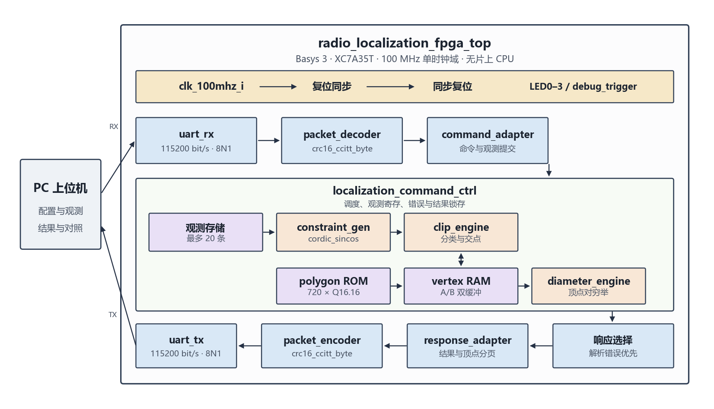

# 2026 数模国赛 B 题的一种 FPGA 定位加速器实现

在 Digilent Basys 3（XC7A35T-1CPG236C）上实现的 FPGA 定位加速器，可用于解决2026数模国赛 B 题问题 1 的多边形定位区域顶点计算。

PC 经板载 USB-UART 下发 2–20 条检测点坐标和示向角，FPGA 在单一 100 MHz 时钟域内完成帧校验、示向角锥半平面生成、Sutherland–Hodgman 多边形裁剪和顶点对直径平方计算，再把顶点、最远点对、核心周期数和错误状态回传。

## 问题 1 模型

问题 1 在半径 $R=1800\ \mathrm{m}$ 的目标圆域内，由检测点坐标和示向度确定干扰源的可行区域。

设第 $i$ 个检测点为 $S_i$，示向度为 $\hat\theta_i$，误差上界为 $\delta$。左右边界角 $\hat\theta_i-\delta$ 与 $\hat\theta_i+\delta$ 各生成一个半平面 $a^{\mathsf{T}}X\ge b$，两条半平面可合为本观测点的误差角锥。目标圆域用外接正 $N$ 边形代替，第 $j$ 个顶点为

$$
P_j=R\sec(\pi/N)\begin{bmatrix}\cos(\beta_j+\pi/N)\\ \sin(\beta_j+\pi/N)\end{bmatrix},\quad \beta_j=\beta_0+\frac{2\pi j}{N}.
$$

对全部半平面做 Sutherland–Hodgman 裁剪，去掉重复点和近共线点后再取凸包，得到定位多边形。空集、单点、线段和有面积区域分开标记。

多边形直径由遍历法计算。对于多边形的各个顶点，任取其中2个顶点计算欧氏距离，取最大者为多边形直径。

本加速器计算其中一次固定边数的裁剪和直径。硬件取 $N=720$，$\delta=1.005^{\circ}$，直径以平方回传。最小包围圆与覆盖判定将在后续版本添加。

## 系统架构



顶层 `radio_localization_fpga_top` 放在 Basys 3 的单一 100 MHz 时钟域内，不使用 PLL 或 MMCM，片上没有 CPU。板载按键经异步置位、同步释放后作为全系统复位。LED0–3 表示空闲、接收、计算和错误，`debug_trigger` 在任务完成时输出。

PC 经 USB-UART 进入 `uart_rx`、`packet_decoder` 和 `command_adapter`。`localization_command_ctrl` 保存最多 20 条观测，调度半平面约束、裁剪和直径计算，并锁存结果。`constraint_gen` 内部调用 18 次迭代的 `cordic_sincos`。`clip_engine` 使用半平面分类和线段交点，对 `vertex RAM` 的两块缓冲交替读写。初始多边形来自编译期生成的 720 顶点 ROM，半径 1800 m，运行时不再乘半径。`diameter_engine` 对最终顶点对穷举距离平方，不在 FPGA 内开方。

结果经响应选择、`response_adapter`、`packet_encoder` 和 `uart_tx` 返回 PC。帧解析错误优先于控制器的正常应答。CRC-16/CCITT-FALSE 分别位于解码器和编码器内部。

## 验证分层

1. Python 双精度模型与位精确模型，其中双精度模型在软件层面实现问题 1 模型的求解，位精确模型模拟硬件层面上的求解，可作为 RTL 代码编写的参考。真实结果将与 python 模型结果对比验证。
2. XSim：模块级自检，包含 24 组位精确联合回归，256 帧协议模糊，以及仿真中连续 1000 次完整任务。
3. Basys 3：USB-UART 实测上述演示任务，并与位精确模型逐位核对。ILA 用于观察命令状态、RAM 切换、顶点计数和约束、裁剪、直径握手。

## PPA 报告

在 Vivado 2024.2 对 `radio_localization_fpga_top` 完成布局布线，器件 `xc7a35tcpg236-1`，报告日期 2026-09-23。

### 时序

| 检查 | 最差裕量 | 总违规 | 失败端点 / 总端点 |
|---|---:|---:|---:|
| 建立时间 | WNS 0.511 ns | TNS 0 | 0 / 25029 |
| 保持时间 | WHS 0.018 ns | THS 0 | 0 / 25029 |
| 脉冲宽度 | WPWS 4.500 ns | TPWS 0 | 0 / 9760 |

最差建立路径位于 `segment_intersection`：由 `denominator_saved_reg[0]` 到 `ratio_result_reg` 的时钟使能。路径组为 `clk_100mhz`，慢工艺角，逻辑级数 21，其中 16 级是 CARRY4。数据路径延迟 8.937 ns，逻辑 4.631 ns（51.8%），布线 4.306 ns（48.2%）。这条路径对应交点除法里分母绝对值的宽进位链。复位相关的 `async_default` 路径组 WNS 为 2.123 ns。

### 资源

| 资源 | 使用 | 可用 | 占用 |
|---|---:|---:|---:|
| Slice LUT | 6491 | 20800 | 31.21% |
| Slice 寄存器 | 9737 | 41600 | 23.41% |
| Slice | 3702 | 8150 | 45.42% |
| Block RAM Tile | 6 | 50 | 12.00% |
| DSP48E1 | 24 | 90 | 26.67% |
| Bonded IOB | 9 | 106 | 8.49% |

LUT 全部用作逻辑，分布式 RAM 为 0，锁存器为 0。6 块 RAM 都是 RAMB36E1，对应初始多边形 ROM 和顶点双缓冲。F7 Mux 612 个，F8 Mux 133 个。Slice 占用高于 LUT 占用，主要因为 9737 个寄存器里有 7269 个由 Slice 外部驱动。时钟资源只使用 1 个 BUFGCTRL。

### 功耗

估算条件为环境温度 25 °C、中等散热、气流 250 LFM，没有仿真活动文件。总体置信度为 Medium：实现状态和时钟活动为 High，I/O 与内部节点活动缺少用户给定翻转率。

| 分量 | 功耗 |
|---|---:|
| 时钟 | 0.020 W |
| 信号 | 0.022 W |
| Block RAM | 0.020 W |
| Slice 逻辑 | 0.019 W |
| I/O | 0.006 W |
| DSP | 0.004 W |
| 静态 | 0.072 W |
| 片上合计 | 0.164 W |

动态功耗 0.092 W，结温 25.8 °C。动态功耗中 `localization_command_ctrl` 占 0.074 W。其内部较高的几项是顶点双缓冲 RAM 0.019 W、半平面约束生成 0.022 W（其中 CORDIC 0.014 W）和多边形裁剪 0.016 W。直径穷举为 0.004 W。

## 板级接口

| 资源 | 约定 |
|---|---|
| 器件 | XC7A35T-1CPG236C，Vivado 器件名 `xc7a35tcpg236-1` |
| 时钟 | W5，100 MHz |
| 复位 | 中心按键 BtnC，高有效；异步置位、同步释放 |
| 串口 | 板载 USB-UART，B18 接收、A18 发送，115200 bit/s、8N1 |
| LED | LED0 空闲，LED1 接收，LED2 计算，LED3 错误 |
| 约束 | [fpga_stage1/constraints/basys3_radio_localization.xdc](fpga_stage1/constraints/basys3_radio_localization.xdc) |

端口和管脚说明见 [fpga_stage1/docs/board_interface_basys3.md](fpga_stage1/docs/board_interface_basys3.md)。

## 复现

工具版本：Vivado 2024.2，Python 3，以及 `pyserial`、`matplotlib`。命令在仓库根目录执行。

生成带 ILA 的比特流和探针文件：

```powershell
vivado -mode batch -source fpga_stage1/scripts/build_t15_ila.tcl -tclargs fpga_stage1/reports/t15_ila
```

用 Hardware Manager 下载生成的 `.bit`。原始比特流与带 ILA 的比特流使用同一套 UART 协议。

重复板级验收（演示观测加可选压力次数）：

```powershell
python fpga_stage1/tools/t15_board_validation.py --port COM7 --stress 1000
```

命令中`--port`需设置为设备管理器中开发板对应的实际 USB 接口。

运行`test_plot.py`可随机生成若干检测点坐标与示向角，并对运算结果进行可视化：

```powershell
python fpga_stage1/tools/test_plot.py --port COM7 --count 6 --seed 20260924
```

软件模型与定点误差报告：

```powershell
python -m unittest discover -s .\fpga_stage1\tb\unit -p "test_*.py" -v
python .\fpga_stage1\model\generate_t02_artifacts.py
python .\fpga_stage1\model\run_t14_regression.py
```

RTL 仿真使用 Vivado XSim 2024.2，测试平台在 `fpga_stage1/tb/`，向量在 `fpga_stage1/tb/vectors/`。各模块的仿真日志见 `fpga_stage1/reports/` 下对应的 `tNN_xsim` 目录。

## 目录

```text
fpga_stage1/
├── constraints/      板级管脚和时序约束
├── docs/             板级接口、协议和数值契约
├── model/            浮点与位精确定点黄金模型
├── reports/          仿真、实现和板测报告
├── rtl/              可综合 Verilog-2001
├── scripts/          Vivado 批处理脚本
├── spec/             与 RTL 同边界的模块规格
├── tb/               测试平台和黄金向量
└── tools/            板测与绘图脚本
```

## 文档索引

| 内容 | 位置 |
|---|---|
| 板级接口 | [fpga_stage1/docs/board_interface_basys3.md](fpga_stage1/docs/board_interface_basys3.md) |
| 数值契约 | [fpga_stage1/docs/t02_numeric_contract.md](fpga_stage1/docs/t02_numeric_contract.md) |
| UART 协议 | [fpga_stage1/docs/t03_uart_protocol.md](fpga_stage1/docs/t03_uart_protocol.md) |
| 模块规格 | `fpga_stage1/spec/` |
| 任务证据 | `fpga_stage1/reports/t04`–`t15` 及对应规格目录 |
